# **The Shop Next Door** - **un juego por el equipo de Kioreco**

Versión 0.8.0
2022\.3.48f1 -> LTS

___
## **ÍNDICE**
___
[**1.**	**Cambios**](#_toc180924127)

   [**1.1.**	**Revisión 1: Prototipo**](#_toc180924128)

   [**1.2.**	**Revisión 2: Beta**](#_toc180924129)

   [**1.3.**	**Revisión 3: Gold Master**](#_toc180924130)

[**2.**	**Introducción: The Shop Next Door**](#_toc180924131)

   [**2.1.**	**Descripción breve del concepto**](#_toc180924132)

   [**2.2.**	**Descripción breve de la historia y personajes**](#_toc180924133)

   [**2.3.**	**Propósito, público objetivo y plataformas**](#_toc180924134)

[**3.**	**Monetización y modelo de negocio**](#_toc180924135)

   [**3.1.**	**Información sobre los usuarios de Kioreco**](#_toc180924136)

   [**3.2.**	**Modelo de negocio de Kioreco**](#_toc180924137)

   [**3.3.**	**Monetización de The Shop Next Door**](#_toc180924138)

   [**3.4.**	**Mapa de empatía**](#_toc180924139)

   [**3.5.**	**Caja de herramientas**](#_toc180924140)

   [**3.6.**	**Modelo de liezo**](#_toc180924141)

   [**3.7.**	**Tablas de productos y precios**](#_toc180924142)

[**4.**	**Marketing**](#_toc180924195)

[**4.1.**	**Durante el Desarrollo**](#_toc180924196)

[**4.2.**	**Mantenimiento Post Lanzamiento (2 años vista)**](#_toc180924197)

[**5.**	**Planificación y Costes**](#_toc180924143)

[**5.1.**	**El equipo humano**](#_toc180924144)

[**5.2.**	**Estimación temporal del desarrollo**](#_toc180924145)

[**5.3.**	**Costes asociados**](#_toc180924146)

[**6.**	**Mecánicas de Juego y Elementos de Juego**](#_toc180924147)

[**6.1.**	**Descripción detallada del concepto de juego**](#_toc180924148)

[**6.2.**	**Descripción detallada de las mecánicas de juego**](#_toc180924149)

[**6.2.1.**	**Vida en la tienda**](#_toc180924150)

[**6.2.2.**	**Vida personal**](#_toc180924151)

[**6.2.3.**	**Resolución de la semana**	16](#_toc180924152)

[**6.3.**	**Controles**	16](#_toc180924153)

[**6.4.**	**Clientes y productos**](#_toc180924154)

[**6.5.**	**Comportamiento de personajes**](#_toc180924155)

[**7.**	**Trasfondo**	25](#_toc180924156)

[**7.1.**	**Descripción detallada de la historia y la trama**](#_toc180924157)

[**7.2.**	**Personajes**](#_toc180924158)

[**7.2.1.**	**Telma**](#_toc180924159)

[**7.2.2.**	**Gemma**](#_toc180924160)

[**7.2.3.**	**Emma**](#_toc180924161)

[**7.3.**	**Entornos y lugares**](#_toc180924162)

[**8.**	**Arte**](#_toc180924163)

[**8.1.**	**Estética general del juego**](#_toc180924164)

[**8.2.**	**Concept Art**](#_toc180924165)

[**8.2.1.**	**Hermanas**](#_toc180924166)

[**8.2.2.**	**Madre**](#_toc180924167)

[**8.2.3.**	**Clientes**](#_toc180924168)

[**8.2.4.**	**Escenarios**](#_toc180924169)

[**8.2.5.**	**Iconos**](#_toc180924194)

[**8.3.**	**Modelos 3D**](#_toc180924170)

[**8.3.1.**	**Hermanas**](#_toc180924171)

[**8.3.2.**	**Clientes**](#_toc180924172)

[**8.3.3.**	**Escenarios**](#_toc180924173)

[**9.**	**Interfaces**](#_toc180924198)

[**9.1.**	**Diagrama de flujo**](#_toc180924174)

[**9.2.**	**Menú de título e inicio de sesión**](#_toc180924175)

[**9.3.**	**Menú de inicio**](#_toc180924176)

[**9.4.**	**Menú de créditos**](#_toc180924177)

[**9.5.**	**MatchMaking**](#_toc180924178)

[**9.6.**	**InGame**](#_toc180924179)

[**9.7.**	**GameOver**](#_toc180924180)

[**9.8.**	**Menú de Pausa**](#_toc180924181)

[**9.9.**	**Menú de Personalización**](#_toc180924182)

[**9.10.**	**Tienda**](#_toc180924183)

[**10.**	**Sonido**](#_toc180924184)

[**10.1.**	**Sonido ambiente y música**](#_toc180924185)

[**10.2.**	**Efectos de sonido**](#_toc180924186)

[**10.3.**	**Lista de sonidos**](#_toc180924187)

[**11.**	**Hoja de ruta del desarrollo**](#_toc180924188)

[**11.1.**	**Hito 1: Prototipo**](#_toc180924189)

[**11.2.**	**Hito 2: Beta**](#_toc180924190)

[**11.3.**	**Hito 3: Gold Master**](#_toc180924191)

[**11.4.**	**Hito 4: Lanzamiento**](#_toc180924192)

[**12.**	**ANEXO:**](#_toc180924193)

___

# 1. **Cambios**
Aquí se incluirán todos los cambios que se realicen en el proyecto en las respectivas revisiones.

**1.1. Revisión 1: Prototipo**

28 de octubre de 2024

Objetivos alcanzados:

- Flujo de juego básico
- Diseño del juego
- Un día en la tienda funcional
- Matchmaking por código
- Estructuración básica del proyecto
- Funcionamiento del cliente básico
- Instanciación del jugador en cada tienda
- Escenario y assets 3D básicos
- Funcionalidad de comprar suministros
- Funcionalidad de escoger actividades de la tarde
- Diseños conceptualizados de los personajes
- Modelos 3D de las hermanas y cliente básico
- Diseño del comportamiento de personajes

Objetivos en proceso:

- Login y base de datos
- Más funcionalidades del móvil
- Máquinas de estados de todos los clientes

Objetivos deseados para el próximo hito:

- Acabar objetivos en proceso
- Sistema de contratación
- Actividades de la tarde con efectos
- Sistema de reponer estanterías
- Más aplicaciones del móvil
- Funcionalidades de semana completa
- Actualizar interfaces

**1.2. Revisión 2: Beta**

Por hacer el 25 de noviembre

**1.3. Revisión 3: Gold Master**

Por hacer el 10 de diciembre

___
# **2. Introducción: The Shop Next Door**
___
## **2.1. Descripción breve del concepto**

***The Shop Next Door*** es un juego competitivo de dos jugadores donde se debe mantener un buen equilibrio entre el trabajo y la vida personal para complacer a una madre de buena familia.

Cada jugador será representado por una hermana distinta, regentando su propio negocio. En el local tendrán que realizar varias tareas relacionadas con su tienda: atender clientes, limpiar el local, comprar suministros, reponer estantes… Al mismo tiempo, podrán manejar su horario de la tarde con las distintas labores a las que quiera dedicar su tiempo. Lo que decida hacer afectará de diversas maneras su trabajo en la tienda el día siguiente y principalmente servirá para crecer como persona.

Una partida completa, de una duración aproximada de 15 a 20 minutos, contemplaría una semana laboral de 5 días con sus respectivas tardes, un día de descanso y el domingo como día final. En este se evaluarán los resultados de ambas hermanas en torno a la labor hecha en la tienda y la evolución de su vida personal, donde será la madre quién dará la victoria a una de sus hijas.
___
## **2.2. Descripción breve de la historia y personajes**

En ***The Shop Next Door*** se sigue la historia de dos hermanas, Gemma y Emma, y su madre, Telma. La madre tenía una tienda grande en la que vendía todo tipo de productos, pero ya se está haciendo mayor y no puede seguir regentándola. Fue entonces cuando decidió construir un muro y dividir la tienda en dos, dándole cada una de las mitades a sus hijas.

Les dijo que quien consiguiera sobrellevar mejor el negocio se iría llevando parte de su herencia. Además, no solo le importaba el negocio, sino que quería verlas crecer hacia mujeres de bien como ella, así que valoraría si también consiguen un buen balance con su vida personal y romántica.
___
## **2.3. Propósito, público objetivo y plataformas**

The Shop Next Door es un juego de partidas cortas y consecutivas orientado a un público casual. Está enfocado para páginas web y dispositivos móviles, con la posibilidad de ser ejecutado en PC.

Tiene el objetivo de proporcionar momentos de diversión y entretenimiento entre amigos o desconocidos. Pretende diferenciarse del resto de juegos del género por la originalidad de la propuesta de la vida personal, generando situaciones cómicas y originales, así como no dejar de lado todo lo que supone dirigir un pequeño comercio.
___
# **3. Monetización y modelo de negocio**
___
## **3.1. Información sobre los usuarios de Kioreco**

Los usuarios a los que están dirigidos los juegos de Kioreco podrían ser definidos por su búsqueda de experiencias creativas. Además, serían jugadores casuales que dediquen un corto tiempo diario a un entretenimiento frenético y divertido. No necesitarían equipos con grandes requisitos, pudiendo lanzar los juegos en navegadores web y dispositivos móviles.

Aun así, se buscaría una base de jugadores menos casuales (midcores) que se viesen más incentivados a invertir su dinero en objetos o servicios especiales, lanzando además los juegos para PC.
___
## **3.2. Modelo de negocio de Kioreco**

Kioreco busca la fidelización de los jugadores dentro de sus juegos, creando una base de usuarios adeptos dispuestos a invertir su dinero en productos *ingame*. Además, usará un sistema de donaciones / PWYC (paga lo que puedas) en el que se ofrecerán los juegos gratis como norma general para que los usuarios puedan conocer la empresa y sus creaciones, y afiliarse si el contenido es de su agrado. El sistema principal de distribución sería en itch.io, aunque se buscaría la expansión a plataformas como Steam. Se tendría un sistema de donaciones a parte en nuestras redes sociales y dentro del juego mediante plataformas como Ko-fi.

Por la búsqueda de clientes casuales y, en el caso específico de ***The Shop Next Door***, compañeros contra los que puedan jugar, dicho modelo de negocio ayudaría a atraer una base amplia de usuarios que se asienten primeramente sobre las mecánicas del juego, y luego se vean incitados a invertir en productos dentro de la tienda. Además, dependiendo de la acogida de la empresa y sus productos, se desarrollarían una serie de productos de merchandising que ayuden a la financiación de los proyectos. También existirá un servidor de Discord de acceso público y moderado donde los usuarios podrían conversar y quedar para jugar en conjunto. Este tendría canales exclusivos para los donantes donde tendrían acceso a ventajas varias como avances exclusivos y contacto con los desarrolladores.
___
## **3.3. Monetización de The Shop Next Door**

The Shop Next Door se plantea como un juego gratuito en el que se incluirían ciertos servicios y productos que se podrían comprar con una moneda de juego, que a su vez se podría adquirir mediante compras reales de manera más rápida. Esta moneda de juego se correspondería a la herencia que la madre otorgaría al final de cada partida a la hermana ganadora. Se incluirán anuncios opcionales que permitirá a la persona que lo desee duplicar sus ganancias.

Entre los productos que se ofrecen, aparte de un sistema de donaciones y canales exclusivos de Discord, entrarían productos como aspectos exclusivos y rotatorios (considerando colaboraciones con otras marcas) para el local, las hermanas y el teléfono que irían cambiando semanalmente, incluyendo nuevas skins cada cierto tiempo. 

Para potenciar la fidelización de los usuarios y su permanencia en el juego se ofrecerían retos semanales donde el jugador deberá completar ciertas misiones, obteniendo objetos o dinero que mejoren la experiencia.
___
## **3.4. Mapa de empatía**
El mapa de empatía de los usuarios de The Shop Next Door sería el siguiente, poniendo enfásis en jugadores con una base de cultura pop importante que entiendan las referencias que el juego contiene. De igual modo, el jugador destaca por su gusto por la cultura y por relacionarse con sus amistades, buscando relaciones fuertes y complejas.

___
## **3.5. Caja de herramientas**
La caja de herramientas de Kioreco tiene como base ofrecer productos gratuitos con microtransacciones. Además, se da la opción de que el jugador pueda ver anuncios para duplicar los beneficios obtenidos en las partidas. Por otro lado, también se realizarán colaboraciones con marcas para cosméticos especiales, y se alentará a los jugadores a que realicen donaciones a cambio de beneficios.

___
## **3.6. Modelo de liezo**
El modelo de lienzo o canvas de The Shop Next Door sería el siguiente:

___
## **Tablas de productos y precios**
   ### **3.7.1 Compra de gemas con dinero**

|**Cantidad (en gemas)**|**Coste (en €)**|
| :-: | :-: |
|20 |5|
|50 |10|
|120 |20|
###
### **3.7.2 Compra de cosméticos con gemas**

|**Tipo**|**Costo (gemas)**|
| :-: | :-: |
|Cosmético de móvil|75 |
|Cosmético de diseño de pared|125 |
|Cosmético de skin para los personajes|325 |
___
# **4. Marketing**
___
##   **4.1. Durante el Desarrollo**

Mediante nuestra decisión de **ir desvelando fragmentos del desarrollo del juego en las redes** de Kioreco, hemos ido incluyendo referencias a otros ámbitos que guardan relación con nuestro juego, para atraer a potenciales jugadores. 
The Shop Next Door bebe de la **cultura pop**, guardando muchas referencias a **Gilmore Girls**, entre otras. Por ello, algunos de los post se han hecho relacionados a estas referencias, atrayendo así a jugadores afines a dicha cultura.

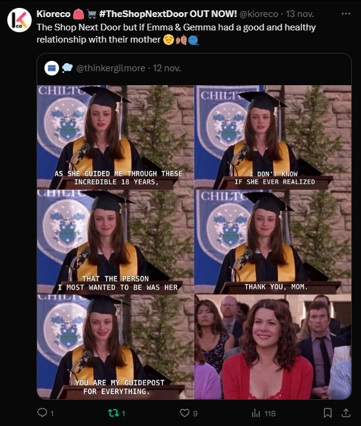
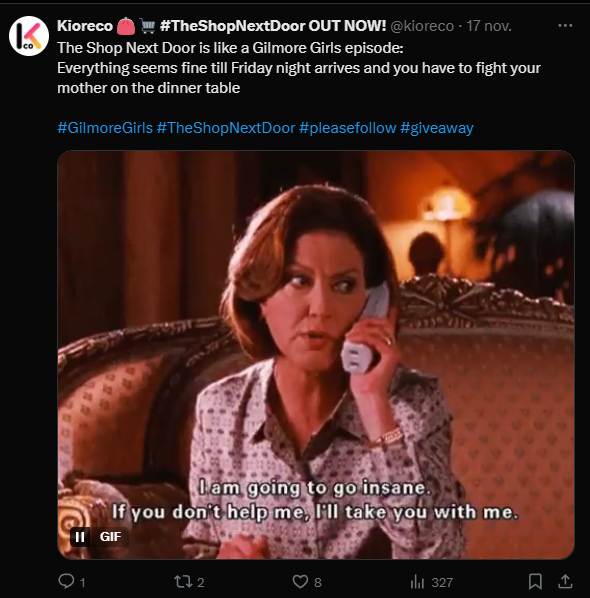
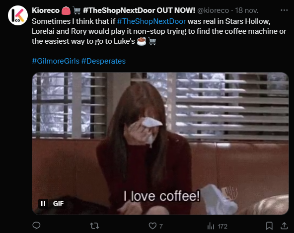

En dichos post, se optó por mantener el tono humorístico del juego para guardar relación al mismo:
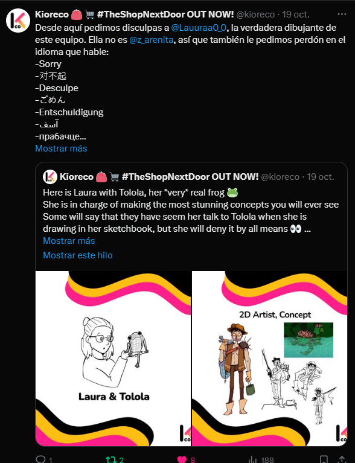
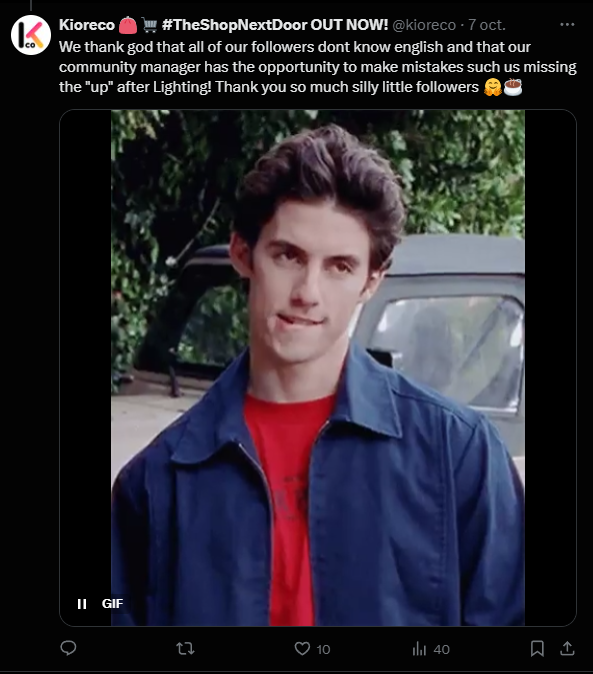

Algunos de los post realizados en las diferentes RRSS (tiktok, twitter, instagram, youtube):
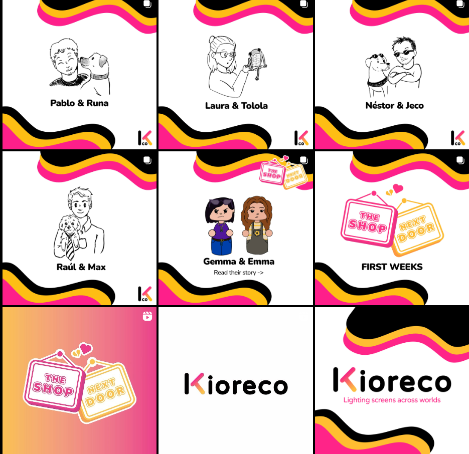
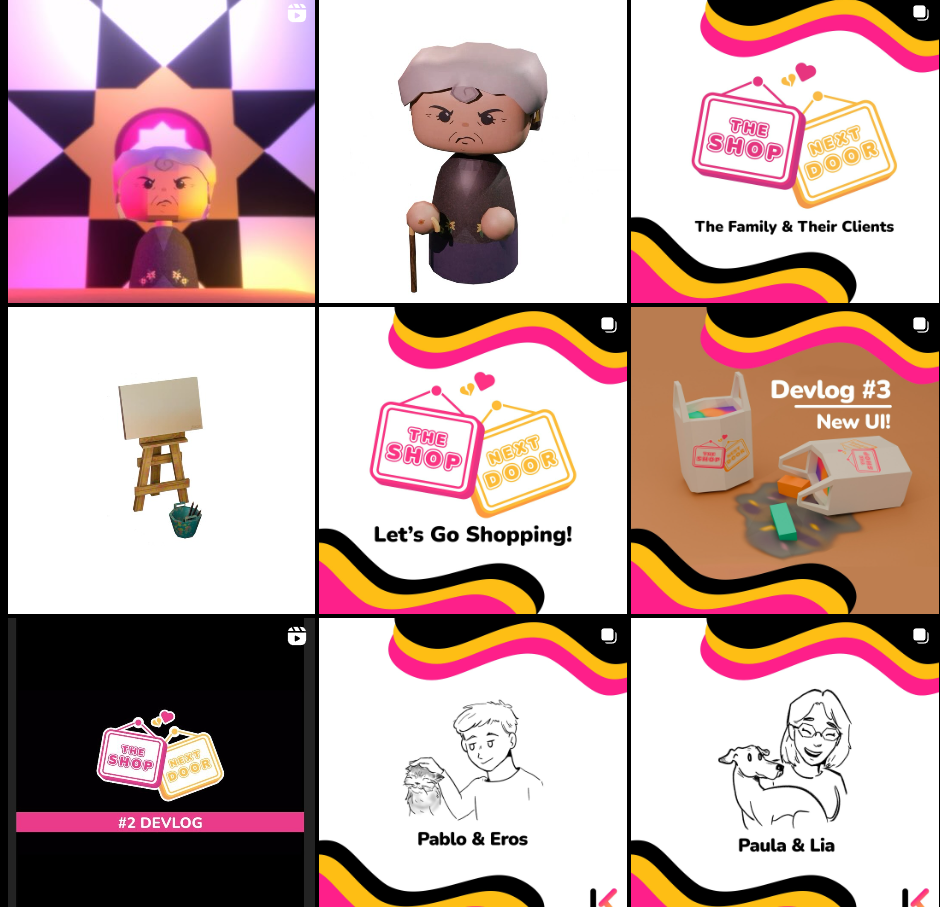
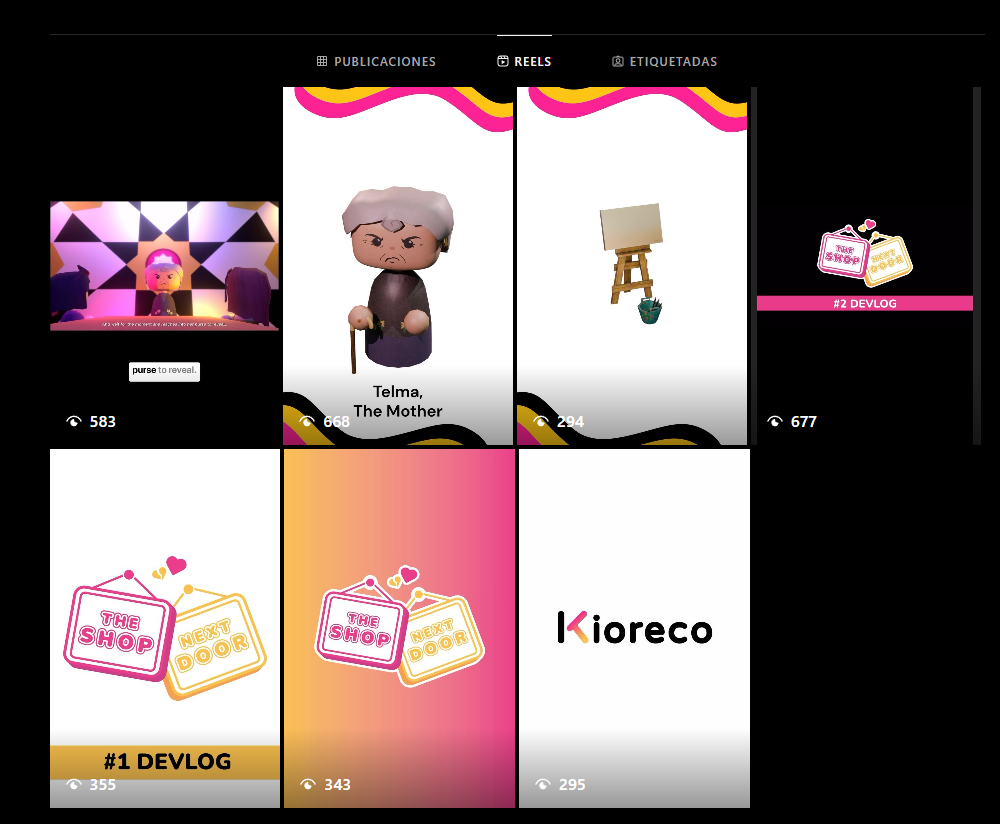
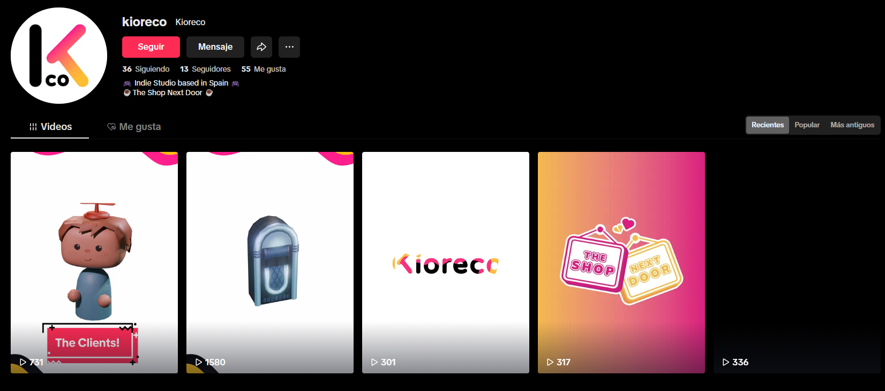
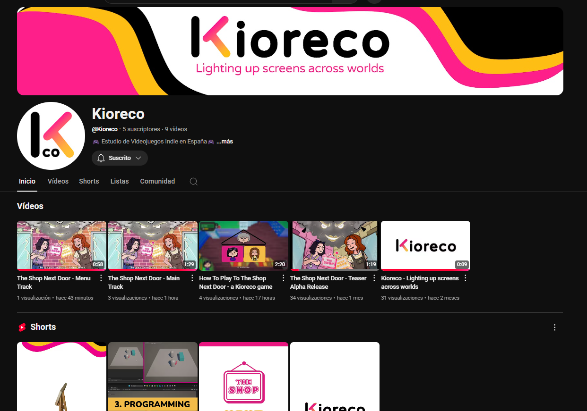

Concluimos que esta era una buena estrategia que seguir para el modelo de negocio con el que planteamos The Shop Next Door: un juego gratuito con posibilidades de micropagos para conseguir cosméticos exclusivos; y un sistema de donaciones que abrirían la puerta a un servidor de Discord exclusivo con contacto directo con los desarrolladores (Kioreco), y para que los jugadores puedan relacionarse entre sí. 

Las donaciones se van a gestionar con **ko-fi**, una plataforma dedicada únicamente a donativos. La elección de esta se ha hecho porque es popular entre el género cozy y puesto que se cree que es la mejor opción para nuestro público objetivo.

Se optó por utilizar **Discord** porque, como equipo apasionado por los videojuegos, a menudo surgen dudas sobre ciertas implementaciones de mecánicas, animaciones y diseños visuales. Es por ello por lo que queremos ofrecer esa misma oportunidad a nuestros jugadores más fieles, permitiéndoles **resolver dudas**, participar en **pruebas de nuevas mecánicas** y acceder a **información exclusiva** (como eventos, actualizaciones o futuros proyectos) antes que nadie.
___
##   **4.2. Mantenimiento Post Lanzamiento (2 años vista)**
The Shop Next Door en un principio era una idea muy ambiciosa que tuvimos que recortar y ajustar para adaptarnos al poco tiempo de desarrollo que teníamos. Se ha gestionado todo lo relevante al proyecto, aprendiendo un flujo de desarrollo profesional y a manejar los diferentes obstáculos que se nos planteaban en el camino. 

Es por ello por lo que hay gran potencial en The Shop Next Door y en su evolución, incluyendo los siguientes detalles:
- **Actualizaciones y mejoras de bugs continuas**.
- **Inclusión de una máquina de café** : cuándo el jugador tenga baja estamina, se podrá tomar una taza de café para que deje de estar cansada.
- **Mejoras e inclusión de más clientes** (como por ejemplo clientes que entren a mirar, mayor interactividad entre estos).
- **Inclusión de OpenAI para mejorar la rejugabilidad** (para la creación de más actividades y su output, el diálogo final donde se dice quién ha ganado, etc).
- **Creación del diario**: donde se almacenarán todas las actividades que hayas descubierto con sus resultados.
- **Eventos especiales con actividades relacionadas**: "christmas season", "spring season"...
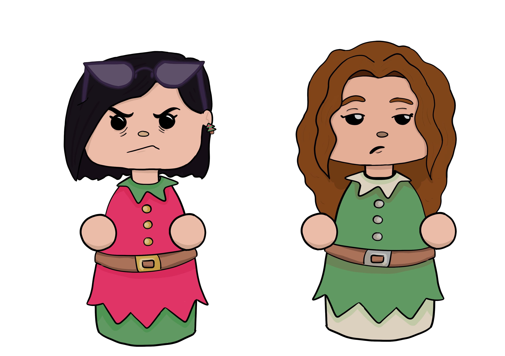
- **Aumentar las mecánicas de la vida personal**.

___
# **5. Planificación y Costes**
___
##   **5.1. El equipo humano**
El equipo principal se compone de 6 miembros cada uno con una especialización diferente, pero con habilidades en distintas aptitudes. Las competencias quedarían resumidas en la siguiente tabla.

- En verde están marcadas las aptitudes en las que la persona **se desenvuelve con soltura**.
- En naranja están marcadas las aptitudes en las que la persona **se desenvuelve con cierta facilidad.**
- En rojo están marcadas las aptitudes en las que la persona **no tiene ningún tipo de habilidad**.
___
En resumen, los roles que cada uno de los miembros del equipo desempeñaría en el proyecto serían los siguientes:
- **Néstor Bermejillo**: Artista 3D de escenarios.
- **Pablo García:** Programador de UX/UI, director narrativo, artista 3D de recurso, programador asistente de mecánicas secundarias y encargado de marketing y RRSS.
- **Laura Méndez:** Concept artist general, artista 2D y animadora.
- **Paula Peralbo:** Programadora de mecánicas, game feel y comportamiento de personajes e inteligencia artifical.
- **Pablo Prior**: Programador back-end, de network y programador asistente en mecánicas.
- **Raúl Somavilla**: Concept artist de personajes, artista 2D y modelador 3D.
___
## **5.2. Estimación temporal del desarrollo**

El control del progreso se realizará mediante los proyectos de GitHub, encargándose cada uno de los miembros de sus tareas asociadas y de crear nuevos *issues* cuando se necesiten. El proyecto contaría con los siguientes hitos:
- Versión Prototipo (27 de octubre de 2024): para este hito debe tenerse el juego planteado y bien definidas las mecánicas cores del juego. Pueden existir errores, pero debe ser estable y estar bien concretado en el GDD. Además, se debe empezar con el marketing con la creación de redes sociales y tener preparada una página web que sirva como porfolio.
- Versión Beta (24 de noviembre de 2024): para este hito se deben tener la mayoría de los assets definitivos y los bugs importantes corregidos. También se tiene que ver una evolución clara con respecto a la versión anterior en cuanto a mecánicas y estética.
- Versión Gold Master (8 de diciembre de 2024): el juego debe estar preparado para su lanzamiento, tanto por el equipo de producción como el de marketing. No debe existir ningún error crítico y tiene que haber una mejora considerable de jugabilidad /rejugabilidad, siendo un producto atractivo y listo para ser comercializado.

**Proyecto visto en GitHub:**

___
## **5.3. Costes asociados**

Se ha realizado un estudio de los costos estimados asociados al desarrollo de los cuatro meses del videojuego, desglosándolos entre costos directos e indirectos. 

___
# **6. Mecánicas de Juego y Elementos de Juego**
___
## **6.1. Descripción detallada del concepto de juego**

***The Shop Next Door*** es un juego de simulación y estrategia de carácter competitivo orientado a dos jugadores. Cada uno tomará el rol de una de las hijas de Telma, una madre con un negocio próspero que, debido a su edad y el tiempo que lleva regentándolo, ha decidido no trabajar más. Telma toma la decisión de dividir su tienda en dos partes iguales para poner a competir a sus hijas (Emma y Gemma), para ver quien es la más capaz de gestionar su propia tienda. Al final de la semana, junto con la gestión de sus vidas privadas, se determinará quien recibe la herencia de la madre.

El **objetivo principal** del videojuego es equilibrar las responsabilidades laborales y personales para asegurar el éxito del negocio, sin olvidar y descuidar las relaciones personales. Cada jugador deberá gestionar el día a día en su tienda, con tareas como atender a clientes, gestionar el inventario de la tienda, limpiar, contratar empleados y/o tomar decisiones sobre que suministros comprar y reponer. También, cada día, los jugadores tendrán que gestionar su tiempo libre, tomando decisiones que afectarán a lo largo de la semana a su desarrollo personal.

El juego se desarrolla en el transcurso de una semana laboral, que termina con una valoración final por parte de su madre Telma, la que decidirá quién de sus dos hijas merece esa ansiada herencia, haciendo un cómputo global de los dos aspectos en la vida de cada hija. Cada partida se estima en un tiempo de 15/20 minutos la cual es ofrecida a base de una experiencia rápida, competitiva, divertida y con situaciones un tanto cómicas a lo largo de esa apasionante semana.
___
## **6.2. Descripción detallada de las mecánicas de juego**

Las mecánicas de The Shop Next Door se dividen en dos grandes bloques: vida en la tienda y vida personal.
___
### *6.2.1 *Vida en la tienda**
Cada jugador deberá realizar diferentes tareas diarias para mantener la tienda y poder darle una gestión adecuada:

- **Atender a clientes:** Proveer productos de manera eficiente se considera esencial para la satisfacción del cliente y asegurar ventas abundantes, haciendo volver a esos clientes. El jugador deberá acercarse a la caja de la tienda para iniciar la tarea de atender a cada cliente esperando a pagar su compra.
- **Reponer suministros**: A lo largo del día, la tienda se va vaciando de productos gracias a la compra de los clientes, lo que hace que el jugador necesite ir reponiendo según la cantidad que se ha ido gastando. Se deberá tener especial cuidado en que productos gastar y que cantidad de ellos se debe pagar para no excederse y quedarse sin presupuesto, pero también que no se quede corta la tienda de stock. Estos suministros se comprarán a través del móvil de cada hermana y serán repuestos en las estanterías con interacciones en las estanterías.
- **Limpiar**: Mantener la tienda limpia y bien organizada influye en la satisfacción y experiencia de los clientes. Las estanterías o partes de la tienda se irán (o serán ensuciadas) y estas deberán ser limpiadas quitando tiempo al jugador con interacciones sobre esas partes.
- **Contratación**: Para tener un negocio competitivo y funcional, es necesaria la ayuda de empleados que mantengan todo en orden y ayuden a la explotación de la tienda. Para ello, el jugador deberá contratar a empleados a través de una función en el móvil, gastando parte del presupuesto en un sueldo diario. 
- **Gestión de tiempo:** Como es normal, ¡el cliente siempre tiene la razón!, es por eso por lo que algunas tareas requerirán una atención personal a cada cliente, esto hace que si no son atendidos se irán impacientando y su visión y valoración de la tienda variará al salir por la puerta del establecimiento. Más vale tenerles contentos…
___
### **6.2.2. Vida personal**
Al mismo tiempo que los jugadores deben tener bajo control la tienda, deben organizarse la tarde para suplir sus necesidades personales. 

- **Pilares de la persona:** Cada jugador contará con 5 pilares fundamentales que representarán el crecimiento personal que ha realizado durante a la semana. Dichos pilares son agrupados de la siguiente forma: romanticismo, amistades, diversión, descanso y desarrollo personal. Podrá consultar los valores en una aplicación en el móvil y serán evaluados de forma cuantitativa por la madre al final de la semana.
- **Actividades:** Se cuenta con un gran banco de actividades variadas (limitadas a 10 por día) diferenciadas por su nombre y distintos parámetros. Cada una de estas actividades tienen tres posibles salidas diferenciadas entre malas, neutras y buenas. Además, cada una proporcionará un porcentaje de cada pilar determinado al realizarla, que permitirá aumentarlos cada día. También se podrá contar con diferentes estados cada día que afecten la salida que se obtendrá. La salida que se obtenga se tendrá en cuenta para otorgar todo el porcentaje de la actividad (salida buena), la mitad de ella (neutra) o nada (mala); condicionado por los estados y un randomizador.
- **Pareja:** El jugador podrá realizar actividades que resulten en la consecución de una pareja romántica. Este factor, además de abrir puertas a nuevas actividades, servirá como bonificador extra para la evaluación de la madre.
- **Calendario:** Cada día, de las 10 actividades aleatorias a las que el jugador puede acceder, podrá elegir un máximo de 3 para realizar durante la tarde. Los resultados de su plan se verán al acabar la jornada laboral junto con el resumen de su tienda y la de la hermana.

___
### **6.2.3. Resolución de la semana**
Tras el transcurso de 5 días y 5 tardes, el juego se terminaría con una charla entre ambas hermanas con la madre. Ella decidirá teniendo en cuenta todo el cómputo de vida personal (pareja, amigos, tiempo libre...) y vida laboral (felicidad de los clientes, dinero, éxito de la tienda...) a quien dejará la herencia del negocio de su vida. Dicha herencia se corresponderá a la moneda de juego que luego se podrá utilizar para comprar en la tienda real.
___
## **6.3. Controles**

The Shop Next Door es un point and click ligado al jugador, su cámara y su vida personal. Todos sus controles van ligados al ratón por lo que va a ser fácilmente jugado en móviles mediante un paso de controles a touchpad con el nuevo InputManager de Unity.
**Ratón:**
- **Botón izquierdo:** mover al personaje y gestión de la interfaz.
- **Botón derecho:** mover la cámara.
- **Rueda del ratón:** hacer zoom.

**TouchPad:**

- **Click:** mover al personaje y gestión de la interfaz.
- **Arrastrar:** mover la cámara.
- **Por determinar:** hacer zoom.

___
## **6.4. Clientes y productos**

Se disponen de diferentes perfiles de **clientes**, se explica de forma superficial el tipo de clientes puesto que se desarrollan por completo en el apartado de comportamiento de personajes:

- **Cliente básico:** entra a la tienda, compra, paga y se va. 
- **Trabajador:** ayuda en las tareas al jugador, por lo que se encarga de reponer estanterías, limpiar la tienda y cobrar a los clientes en la caja.
- **El niño:** entra a la tienda únicamente para mancharla, se mueve mucho más rápido por la tienda y tendrá que ser echado por el jugador.
- **Karen:** variación del cliente básico, mucho más susceptible que este por lo que se irá a quejar muy a menudo a los trabajadores.
- **Tacaño:** entra con un presupuesto marcado, compra cosas sin medida y cuando llega a la caja y no puede pagarlo, se enfada, monta una escena y se va sin comprar.

Se disponen de varios productos por categoría:

- **Ropa y zapatos:** Camisetas, Jerséis, Vestidos, Pantalones, Faldas, Pijamas, Deportivas y Zapatos Edgy.
- **Libros y papelería:** Libros de fantasía, de romance, de historia, pinturas, rotuladores y lienzos.
- **Comida:** manzanas, pizzas, sandías y melones, calabaza, carne y pescado.
- **Entretenimiento:** Juego Hasta que la noche nos separe, Juego Decor Dilemma, Juego 3, Película 1, Película 2, Película 3, CD Taylor Swift, CD 2 y CD 3

___
## **6.5. Comportamiento de personajes**

**Cliente básico:**

Entra a la tienda con su lista de la compra hecha, busca la primera estantería a la que tiene que ir. Se acerca a la estantería, coge el elemento y siempre que tenga más elementos que comprar, busca la siguiente estantería a la que ir. Cuando no le queden más productos que comprar se acercará a la caja donde, si hay gente en la caja esperará su turno, si no hay gente, esperará a que alguien le atienda y se irá de la tienda. Si es su turno en la caja y no tiene quien le atienda, esperará a que alguien venga. Si no tuviera hueco en la cola, independientemente de su estado emocional, se irá de la tienda disminuyendo su felicidad. 

Mientras esté comprando le puede surgir duda de alguno de los productos que va a comprar, cuando esto suceda irá a preguntar al jugador acerca de ese producto. Cuando acabe continuará con la última tarea que estuviera haciendo.

Otro factor importante es el estado emocional de los clientes: feliz y enfadado.

- **Feliz:** al pagar dejará una propina a los trabajadores. Es su estado inicial.
- **Enfadado:** una vez llegue a este estado dejará de hacer lo que esté haciendo y se irá por la puerta.

Sobre la felicidad y el enfado, se dispone de una variable perteneciente al intervalo [0, 1], donde 0 es estar feliz y 1 estar enfadado e irse. Irá aumentando en 0.05 con interacciones que lo propicien. Estos datos se modificarán atendiendo al comportamiento que esté teniendo el npc, por ejemplo, que tenga demasiada poca tolerancia y no acabe de comprar ningún cliente por esta razón. 

La transición entre ambos viene dada por los siguientes eventos:

Sobre estos dos estados se tiene un intervalo de 0-100, empieza con una felicidad de 100, y según se vaya topando con elementos que le enfaden, irá bajando hasta llegar a 0, donde se irá de la tienda independientemente de donde estuviera.
La transición entre ambos viene dada por los siguientes eventos:
-	Cuando no hay todas las cantidades que quiere de un producto (-15 felicidad).
-	La tienda está muy sucia o es ralentizado por las manchas del suelo más de 3 veces (- 3 felicidad).

Se ha elaborado una FSM, para algunas transiciones se ha hecho una SFSM para favorecer la escalabilidad en un futuro. También se usa para las variaciones de este cliente, y así no modificar el código en dichos casos. El estado final pagar, una vez acaba la animación se iría de la tienda.

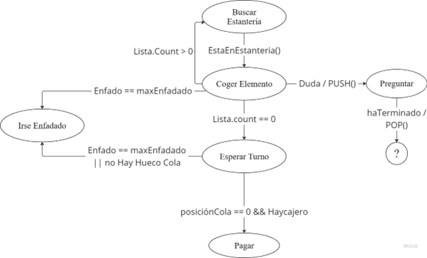

___

**Karen:**

Es la variación 1 del cliente genérico. Tiene el mismo comportamiento básico a excepción de que es mucho más irascible e impulsiva que el resto de los clientes, por lo que tiene menos tolerancia a los sucesos que alteran sus emociones. Además, cuando esto suceda se irá a quejar al jugador.

Si llegase a enfadarse por completo, se acercará a cualquier empleado, se quejará una última vez y saldrá de la tienda sin comprar. A excepción de cuando sea la hora de cierre.

Sobre la felicidad y el enfado, funciona igual que en el anterior, a diferencia de la cantidad de enfado: si se topa con una mancha se resta 10, si no tiene todos los productos que tiene 25.

Se ha realizado una SFMS. Al igual que en el anterior, el estado final pagar, una vez acaba la animación se iría de la tienda.

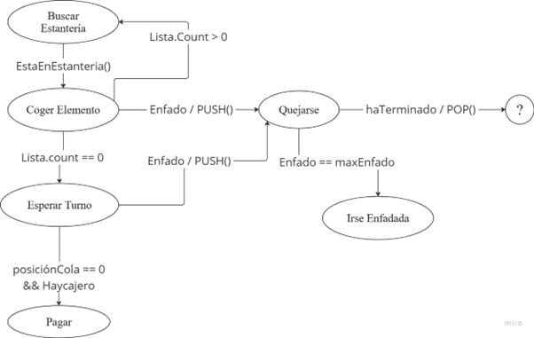

___
**Tacaño:**

Es la variación 2 del cliente genérico. Este entra a la tienda, va las estanterías de los productos a coger elementos, pero con un número aleatorio, cuando acabe, pagará y se irá de la tienda. Se enfadará únicamente con el dinero en la caja, el resto de los eventos (tienda sucia, esperar en la cola…) no le enfadan, a excepción de si no tiene hueco en la cola.

Tiene un presupuesto establecido, y su reacción en la caja dependerá de cuánto se pase de ese presupuesto:

- **Se pasa hasta 40€ o cuesta menos de su presupuesto establecido:** se va feliz de la tienda. Si cuesta menos de su presupuesto establecido, dará de propina el sobrante.
- **Se pasa de 41€ a 80€:** se queja de que las cosas están muy caras, pero paga.
- **Se pasa más de 81€:** se pone a gritar, se niega a pagar y se va.

En lo que respecta al comportamiento visual se va a comportar muy parecido al cliente normal, ya que la única diferencia es su reacción en la caja. 

Se ha implementado un FSM. Al igual que en el anterior, el estado final pagar, una vez acaba la animación se iría de la tienda.

___

**El niño:**

Entra en la tienda siempre que no haya un trabajador contratado, se irá moviendo a posiciones aleatorias y ensuciando la tienda a medida que se va moviendo.

Este se irá de la tienda si un trabajador es contratado o si ya se ha cansado de manchar (ha manchado todo lo que podía manchar). 

La lógica de manchar se explicará más tarde, pero nunca manchará donde ya haya una mancha.

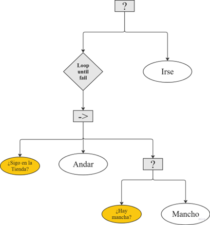
___
**Trabajador:**

Desempeñará 3 acciones: limpiar la tienda y atender en la caja, y, si no tiene que realizar ninguna de esas acciones, solo andará por la tienda. La acción más prioritaria es atender la caja.

Aunque luego se mostrará el diagrama descriptivo, se va a detallar aquí como se ha implementado a este. Se ha realizado un BT, US, FSM para definir su comportamiento, como el BT y la FSM se entienden fácilmente solo viéndolo no se va a profundizar mucho en ellos.

Siempre que siga contratado, realizará ese comportamiento, si no, se irá de la tienda.
Para seleccionar las acciones a desarrollar, se ha implementado el US, este tiene las siguientes variables y como afectan a las acciones.

- **Limpiar**: la relación entre ambas variables se decide con una fusión de valor mínimo, de esta manera, como la felicidad nunca será cero, realizar la acción depende del número de manchas, por lo que, si es 0, no se va a contemplar siquiera.
   - **Manchas totales**: relación directa y creciente. Cuántas más manchas más necesidad de limpiar.
   - **Felicidad media**: curva lineal, decreciente e inversa. Cuánta más felicidad media haya, menos necesidad de limpiar, y menos prioritario, por ende.
- **Atender en la caja**: la relación entre las variables se hace de la misma forma del anterior.
   -	**Número de clientes en la caja**:  relación directa y creciente, a más clientes más necesidad de atender la caja.
   -	**Felicidad media**: curva línea, creciente y directa. Cuánta más felicidad media más necesidad de atender en la caja.
-	**Andar**: la variable es una constante que siempre vale 0.1, por lo que cuando no hay ni manchas ni clientes en la cola (la salida de la fusión de estas será 0), realizará esta acción, si no, realizará la acción elegida según los factores de decisión y las variables.

Cómo se ha mencionado, se compone de un BT, US y FSM:

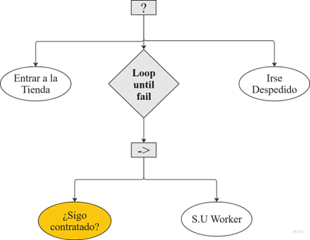
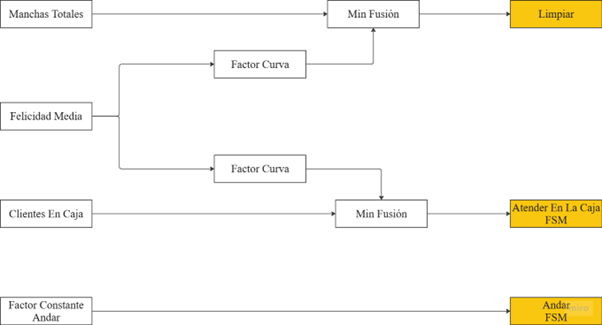
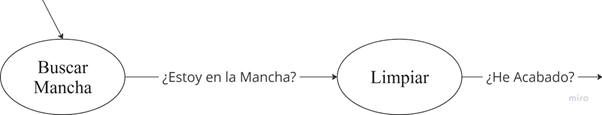
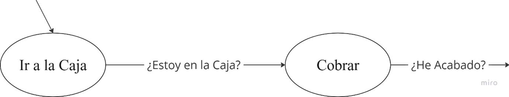

La representación del estado de los clientes (enfado, felicidad, indiferencia, duda, queja, gritos…) se representará encima de los mismos, como sucede en los sims, también se ve completado con los plumbob:

___
# **7. Trasfondo**
___
## **7.1. Descripción detallada de la historia y la trama**

Telma es una señora de bien. Tiene dos hijas y un marido sepultado. A su edad está empezando a dolerle en la espalda, las piernas, las manos y en ocasiones en las cejas, pues el ceño fruncido y sus respectivas arrugas cuestan llevarlas todos los días. 

Telma tenía una tienda. Era grande, coqueta y tenía una clientela asegurada, en definitiva, un negocio exitoso. El problema vino cuando sus manos ya no podían ni contar el dinero de la caja. Fue entonces cuando decidió deshacerse de todo. No habría más ropa que doblar, libros que colocar ni empleados que gritar. 

Claro está que no quería que su negocio acabase enterrado bajo el polvo, así que empezó a susurrar a sus hijas. A Gemma le dijo que con la tienda conseguiría el dinero suficiente para comprarse aquella buena casa que vio a las afueras. A Emma simplemente le dijo que podría comprarse las chuminadas que quisiera. Aquello fue solo la semilla, pero no fue hasta que habló de herencias que sus hijas no se agarraron de los pelos para coger las llaves de la tienda. 

Entonces construyó un muro y duplicó las llaves. Cada una de sus hijas regentaría una tienda, y la que consiguiese volver a florecer su negocio se llevaría con él la herencia que tanto ansiaban. 
___
## **7.2. Personajes**
___
### **7.2.1. Telma**

Telma es una mujer mayor cuyo marido murió hace años. Es una persona seria y recatada, educada en una familia de dinero y con sus costumbres bien arraigadas. Siempre ha sido independiente y capaz de regentar su negocio con éxito, pero los efectos de la edad le han limitado sus capacidades motrices, teniendo que jubilarse. Tiene personalidad y apariencia similar al personaje de Emily Gilmore, no manteniendo una relación afectuosa con sus hijas, sino más supervisora y controladora.
___
### **7.2.2. Gemma**

Gemma es una de las hermanas que el jugador podrá controlar. Tiene una personalidad seria y cansada, siempre consumida por todos los aspectos de su vida por querer tenerlo todo bajo control. Tiene el pelo corto por los hombros, oscuro con reflejos morados y un estilo simple y clásico, alisado casi a diario. Es la hermana mayor y por tanto tiene una necesidad superior de agradar y complacer a su madre. Tiene una relación complicada con su hermana, con quien se lleva pocos años y, por tanto, se compara con ella continuamente.
___
### **7.2.3. Emma**

Emma es la hermana pequeña que el jugador podrá controlar. Tiene una personalidad mucho más desenfadada y aparentemente despreocupada, pero en realidad siente una desilusión e inquietud por no saber cómo llevar la vida. Siente que ha fracasado y que no ha conseguido cumplir los estándares que debería con su edad, sin embargo, se siente tan abrumada por estos pensamientos que no es capaz de ponerse a trabajar en dichos aspectos. Intenta mantener una apariencia y posición en la vida desinteresada como medida protectora para que su mundo no se le eche encima. Siente interés por su hermana y desearía llevarse mejor, pero la siente inaccesible y tampoco sabe cómo relacionarse con ella pues siempre la nota enfadada. Tiene una apariencia alegre, con el pelo ondulado teñido pelirrojo con las raíces oscuras asomando, y suele llevar ropa colorida en cierta medida.
___
## **7.3. Entornos y lugares**

La tienda que ambas hermanas regentará debe ser grande y simétrica, dividida por un muro. Las paredes exteriores serán cada una de los colores representativos de cada hermana (rosa y amarillo), y las interiores azules. En las vecindades se verán tiendas que hagan referencias a juegos realizados con anterioridad por el equipo de desarrollo. 

Habrá mínimo cinco modelos de tienda diferentes que se elegirán aleatoriamente al principio de cada partida. Cada uno de estos tendrán zonas asignadas donde se podrán vender productos de distintos tipos: ropa, comida, entretenimiento y libros y papelería.
___
# **8. Arte**
## **8.1. Estética general del juego**

La estética general del juego sería cartoon, simple y acogedora. Tanto el escenario como los personajes mantienen una estética lowpoly destacada por su diseño sencillo y adorable. Este estilo se utiliza en contraste con la historia de familia desestructurada y la agresividad que suelen tener los juegos competitivos. Aparte de ser visualmente más interesante para el público objetivo, ofrece la posibilidad de simplificar los escenarios y personajes para evitar bajadas de rendimiento al lanzarlo en navegadores web.
___
## **8.2. Concept Art**
___
### **8.2.1. Hermanas**
Las hermanas Emma y Gemma, presentan una apariencia opuesta definida por sus respectivas personalidades.

Gemma siendo la más seria y responsable de las dos, muestra físicamente más formalidad que su hermana. Siempre viste casual, con una camiseta sencilla y unos vaqueros, pero con la dignidad propia de su madre. Tiene el pelo corto, liso y negro desde nacimiento y así se lo ha dejado. Es una persona algo irritable y que suele evitar los cambios bruscos.

Por otro lado, Emma es algo alocada y despreocupada. Tiene el pelo rizado, largo y teñido de rojo cobrizo, en contra de las opiniones de su madre ya que seguir las normas no es algo que le guste hacer. De las dos, también es la más expresiva, aunque a veces no le convenga serlo, por esa razón siempre viste con un mono gris y una camiseta blanca con rayas amarillas.

Referencias para Gemma:

Referencias para Emma:

Primeros bocetos:

Las expresiones ha sufrido un gran cambio respecto al inicio, para que coincida más con el estilo del juego, además se han añadido expresiones dependiendo de los posibles estados que tenga el jugador. Por esta razón las expresiones creadas para ambas hermanas son Cansada, Feliz, Irascible/Enfadada, Miedosa, Extrovertida/Habladora y Coqueta.

Hoja de expresiones de Gemma:

Hoja de expresiones de Emma:

Concepts de los modelos ingame de las hermanas:

___
### **8.2.2. Madre**
La madre, Telma, es una señora regia. Tiene el ceño constantemente fruncido y el pelo corto platino. Se caracteriza por tener un rizo rebelde en el centro de la cara y pendientes dorados. Su forma debe ser triangular para representar la estabilidad y presencia que tiene al presentarse en una sala, y debe demostrar el dinero y el estilo adinerado que la representa. Una clara referencia para su diseño y personalidad es Emily Gilmore de Gilmore Girls.

Concepts: 

Hoja de Expresiones:

Inicialmente no se iba a realizar un concept ni un modelo de Telma ya que no se veía necesario, pero con el paso del tiempo se ha decidido añadir un modelo de la madre. 

Concept Modelo Telma: 

___
### **8.2.3. Clientes**
Para los clientes se ha decidido crear unos modelos generales para agilizar el proceso y añadir algún tipo de característica distintiva en alguno de ellos que cuentan con una mecánica única. 

Turn around del modelo genérico

___
### **8.2.4. Escenarios**
El escenario en el que se jugará deberá ser amplio y representar una tienda. Ambas tiendas deben estar conectadas pared con pared, pero sin poder pasar de una a otra. Tendrán estanterías y muebles para poder exponer los productos, y una caja registradora donde cobrar los clientes. Habrá mínimo 5 variaciones de tiendas con secciones diferentes, las paredes interiores serán azules y las exteriores rosas (para el host) y amarillas (para el cliente).

Un boceto de la primera tienda es el siguiente:

### **8.2.5. Iconos**
Los iconos se han creado para que el jugador, al elegir que comprar dentro de la tienda, pueda tener una imagen de lo que está comprando. Es decir, son imágenes 2D orientativas. Dentro de la tienda encontramos varias secciones de productos, los iconos para estas secciones son:

Sección de Arte:

Sección de Comida:

Sección de Entretenimiento:

Sección de Ropa:

### **8.2.6. Iconos de emociones**
Se han realizado estos iconos diferentes para usarlo para dar feedback a los jugadores de lo que sienten los clientes, ya sea que estan contentos, enfadados o tienen dudas.

Emoción del tacaño cuando la compra es barata:

Emoción del tacaño cuando la compra es cara:

Emoción del tacaño cuando la compra es muy cara: 

Estas tres emociones se han decidido hacer con bocadillos y con emoticones y símbolos simples para que los jugadores entiendan las emociones del tacaño. 

Emoción del niño cuando mancha:

Esta emoción saldrá cuando el niño haga alguna maldad en la tienda (cuando manche) por eso el diseño de demonio picaro

Emoción de queja:

Este diseño de queja se ha inspirado en los bocadillos de insultos o quejas de comics españoles. 

Emoción de cansancio:

Diseño inspirado en la onomatopeya de dormir de comics. 

Emoción de enfado:

Emoticono de enfado con estilo cartoon que saldrá cuando algún cliente este muy enfadado. 

Emoción de pregunta:

Simbolo de pregunta que saldrá cuando algún cliente tenga alguna duda. 

___
## **8.3. Modelos 3D**

Los modelos deberán simple para no añadir sobrecarga de geometría y apoyar el estilo simple y adorable que se necesita.
### **7.3.1. Hermanas**
Las hermanas dentro del juego mantendrán una apariencia similar a los clientes, pero diferenciada por sus modelos más llamativos. Además, sobre sus cabezas tendrán un señalador como el plumbob de los juegos de Los Sims.

Los modelos sin texturizar son los siguientes (Emma y Gemma):

Los modelos texturizados de las hermanas son los siguientes:

___
### **8.3.2. Clientes y Trabajadores**
Los clientes deberán ser diferenciables entre sí según los distintos arquetipos que representen. Los trabajadores, por su parte, se diferenciarán de los demás personajes ya que tienen un delantal de color verde.
Modelo de empleado sin texturizar: 

Modelo de empleada sin texturizar: 

Modelo de empleado texturizado:

Modelo de empleada texturizada:

Se ha elegido estos diseños ya que no desentonan mucho fuera del resto de personajes, pero tienen el elemento destacado del delantal, sin ser muy vistoso para no quitar atención de las hermanas. 

Modelo de señora mayor sin texturizar:

Modelo de señora mayor texturizada:

Modelo del camionero sin texturizar:

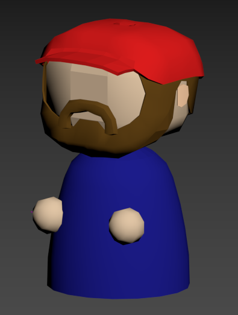

Modelo del camionero texturizado:

Modelo de Karen sin texturizar:

Modelo de Karen texturizado: 

Modelo de niño sin texturizar:

Modelo de niño texturizado:

Modelo de tacaño sin texturizar:

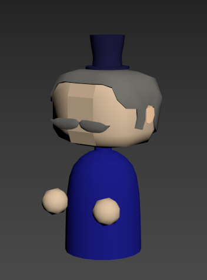

Modelo de tacaño texturizado:

### **8.3.3. Escenarios**
El primer modelo de tienda simple que permitirá vender comida y ropa sería:

La tienda texturizada:

Además, se han creado 8 sets jugables para la tienda. 

Set de Música:

Set de Frutería: 

Set de Bebidas:

Set de Ropa:

Set de Pinturas:

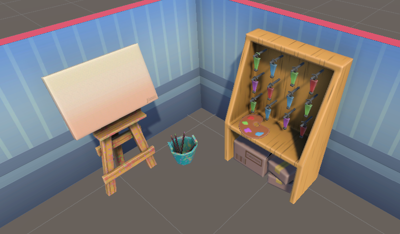

Set de Peliculas:

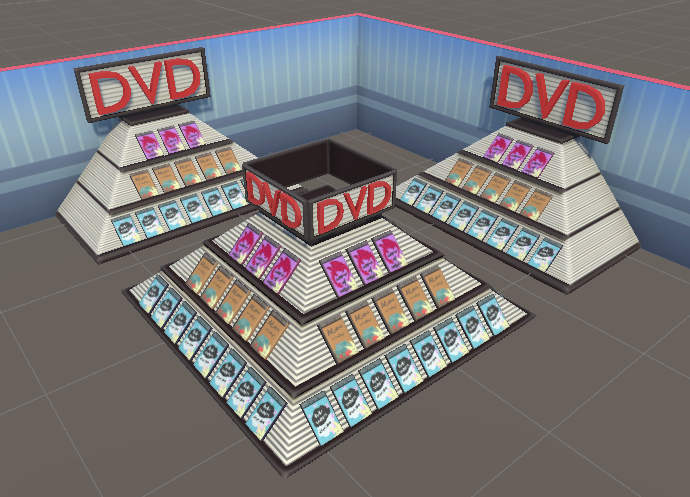

Set de Videojuegos:

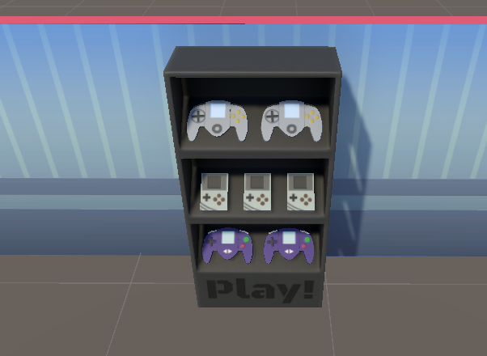

Set de Libros:

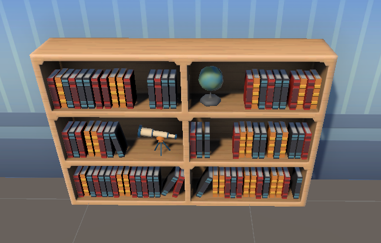

Adicionalmente, se crearon dos tipos de cajeros, el primero es donde el jugador tendrá que cobrar a los clientes, y otro cajero de autoservicio a modo de balance en caso de que el jugador no pueda cobrar a todos los clientes.

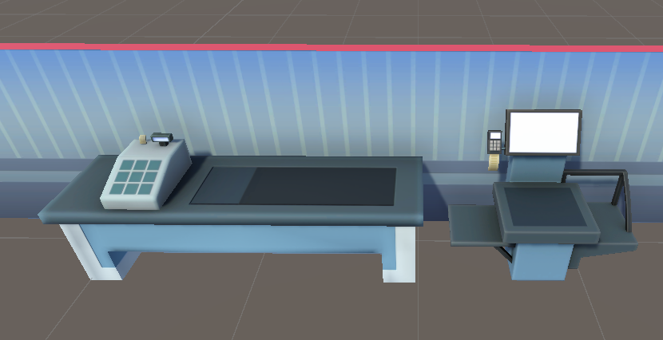

Por último, se crearon asstes para el entorno exterior de la tienda.

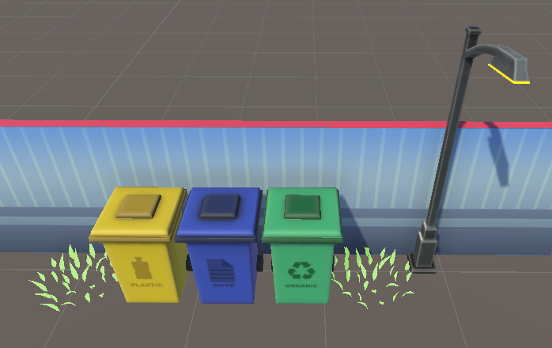

___
# <a name="_toc180924198"> **9. Interfaces**

___
## **9.1. Diagrama de flujo**

El diagrama de flujo entre pantallas y durante una partida quedaría de la siguiente manera:

___
## **9.2. Menú de título e inicio de sesión**

Diseños finales para el menú de inicio:

Menú de inicio de sesión:

___
## **9.3. Menú de inicio**

Mejora del dibujado y disposición de elementos para el menú de inicio: 

En este menú, para que el cuadro no quedará vacío, se ha creado una foto en la que se puede ver claramente las personalidades de las hermanas.

___
## **9.4. Menú de créditos**

___
## **9.5. MatchMaking**

Diseño para la beta de la escena de matchmaking sería el siguiente

Disposición de varias opciones tanto para crear partida como para unirse a una. Inclusión de copiar el código de la partida y cancelar el emparejamiento.
___
## **9.6. InGame**

El diseño final para la beta de la escena de juego con la interfaz ingame sería:

Disposición de interfaz con botón de abrir tienda (ready) antes de comenzar la partida y de waiting players para que estén los dos jugadores preparados.

Interfaz por defecto al comienzo de la partida con el cómputo de dinero acumulado, felicidad de los clientes, almacenaje, día y hora de la semana, energía del personaje y móvil personal.

Distintas interfaces del móvil según la sección que se vaya consultando: actividades, compras, contrataciones y vida personal.
___
## **9.7. DayOver**

Interfaz para la finalización de un día laborable:

___
## **9.8. Menú de Pausa**

Concepto por realizar.
___
## **9.9. Menú de Personalización**
Interfaz para el prototipo del menú de elección de cosméticos disponibles.

___
## **9.10. Tienda**

Interfaz de tienda para la beta

___
# **10. Sonido**
___
## **10.1. Sonido ambiente y música**

Hay dos temas diferenciados, uno para la parte de menú y otra ingame. El primero se caracteriza por ser una música tranquila que incite a jugar, el segundo es un poco más animado para no perder el objetivo del juego: una competición.
Música por concretar: sin derechos de distribución ni uso.

___
## **10.2. Efectos de sonido**

Los efectos de sonidos servirían como feedback auditivo para el jugador, sobre todo en ocasiones importantes, como puede ser: Que un cliente entra en la tienda, que los clientes empiezan a molestarse y a murmurar que se van a ir de la tienda, comprar un empleado nuevo.

Sin concretar: sin derechos de distribución ni uso.

___
## **10.3. Lista de sonidos**

-	Música de juego
-	Música de menús
-	Música de la escena final
-	Sonido botones de los menús
-	Sonido de caja registradora
-	Sonido de compra en la tienda de cosméticos
-	Sonido cuando se abre la tienda
-	Sonido despertador para cuando comienza el trabajo
-	Sonido tick-tack para la tienda llegando al cierre
-	Sonido de botones de las estanterías
-	Sonido de acción errónea
-	Sonido de cobrar
-	Sonido de limpiar
-	Sonido de abrir y cerrar el móvil
-	Sonido de gastar dinero
-	Sonido del vigor bajo
-	Sonido alerta del vigor
-	Sonido de alerta de estanterías
-	Sonido de mejorar las estanterías
___
# **11. Hoja de ruta del desarrollo**

___
## **11.1. Hito 1: Prototipo**

Para este hito debe tenerse el juego planteado y bien definidas las mecánicas cores del juego. Pueden existir errores, pero debe ser estable y estar bien concretado en el GDD. Además, se debe empezar con el marketing con la creación de redes sociales y tener preparada una página web que sirva como porfolio.

- **Fecha de entrega**: 27 de octubre de 2024

___
## **11.2. Hito 2: Beta**

Para este hito se deben tener la mayoría de los assets definitivos y los bugs importantes corregidos. También se tiene que ver una evolución clara con respecto a la versión anterior en cuanto a mecánicas y estética.

- **Fecha de entrega**: 24 de noviembre de 2024

___
## **11.3. Hito 3: Gold Master**

El juego debe estar preparado para su lanzamiento, tanto por el equipo de producción como el de marketing. No debe existir ningún error crítico y tiene que haber una mejora considerable de jugabilidad /rejugabilidad, siendo un producto atractivo y listo para ser comercializado.

- **Fecha de entrega**: 8 de diciembre de 2024

___
## **11.4. Hito 4: Lanzamiento**

Para el lanzamiento se deberá organizar una última campaña de lanzamiento que involucre la publicación del juego. Esta se compondrá de varios anuncios en redes sociales y promociones que ayuden a dar a conocer al juego.

- **Fecha de lanzamiento**: 15 de diciembre de 2024

___
# **12. ANEXO:**
**Tabla de percepciones cliente básico:**

|**Nombre**|**Implementación**|**Acceso**|
| :-: | :-: | :-: |
|Tiene la lista hecha|Cuando tenga la lista completa (el número de elementos sea mayor que 0) podrá comenzar su objetivo en la tienda|PULL|
|Buscar estantería donde está el producto|Pide a un script (el encargado de gestionar la tienda: TiendaManager) la posición de qué estantería tiene ese producto|PUSH|
|Tiene más productos que comprar|Consulta la extensión de la lista de la compra y mira si es mayor que 0|PULL|
|Puedo coger toda la cantidad de este producto|TiendaManager gestiona el coger elementos de una estantería, si no puede coger todos se le devuelve -1|PUSH|
|Tengo alguna duda de los productos|De forma aleatoria, dirá si un tiene duda o no (número aleatorio entre 0 y 1, false o true)|PULL|
|Quién está cerca para preguntar|Calcula la distancia a cada trabajador y va al más cercano|PULL|
|Está en destino|Comprueba la distancia a la posición a la que se le ha mandado|PULL|
|Hay hueco en la cola|Le dice al TiendaManager que quiere ponerse a la cola y esta le devuelve la posición que le toca. Devuelve -1 si no tiene hueco|PUSH|
|Puedo avanzar en la cola|Para el resto de los clientes de la cola se lanza un evento cuando alguno de los clientes haya abandonado su sitio|PUSH|
|Estoy primero en la cola|Consulta su posición en la cola y mira si es 0 o no|PULL|
|Hay cajero|Cuando haya alguien en la caja se lanza un evento para actualizar la variable del cliente|PUSH|
|Puedo dar propina|Consulta su estado de ánimo y mira si puede darla o no|PULL|
|Cuánto tiempo ha pasado|El cliente calcula su tiempo de espera, por ejemplo: espera mientras paga, antes de irse|PULL|
|Estoy feliz / enfadado|Consulta su propio estado de ánimo y mira si ha cambiado en algún momento|PULL|
|Me tengo que enfadar|Espera a recibir un evento que le cambie el estado de ánimo|PUSH|
|He tocado un charco|Se lanza un evento que ralentice el movimiento del cliente al coger el charco|PUSH|

**Tabla de acciones cliente básico:**

|**Nombre**|**Implementación**|**Efecto**|
| :-: | :-: | :-: |
|Andar|El navmesh se encarga de mover al agente a la posición que se le mande|El personaje se mueve hasta el destino|
|Buscar estantería|Coge el primer elemento de la lista de la compra y le pide al TiendaManager la posición de esa estantería||
|Coger de la estantería|Le dice al TiendaManager la cantidad de productos y el nombre del producto que va a coger|El número de productos a coger se actualizará en el stock de la estantería. Nunca será menor a 0|
|Preguntar al empleado|Espera 2 segundos al lado del empleado, este ha interrumpido durante ese tiempo su tarea.|Interrumpe la tarea del empleado influyendo en la tienda|
|Esperar turno en la cola|Espera en su posición en la cola hasta que este cambie|Se añade un cliente a la cola|
|Pagar|Se actualiza el dinero del jugador, la UI del dinero, y espera el tiempo de cobro antes de irse|El dinero del jugador aumenta|
|Enfadarse|Aumenta la variable de estado de ánimo del cliente acercándose al umbral del enfado.|Si este llega al límite, se va de la tienda.|
|Dar propina|Si el cliente se mantiene feliz, pagará un 21% extra, a modo de propina, de lo que haya supuesto la compra|Aumenta aún más el dinero del jugador|

**Tabla de percepciones Karen:**

Como es una variación del anterior, las percepciones del anterior están marcadas en gris para diferenciarlo de las nuevas percepciones y facilitar la lectura.

|**Nombre**|**Implementación**|**Acceso**|
| :-: | :-: | :-: |
|Tiene la lista hecha|Cuando tenga la lista completa (el número de elementos sea mayor que 0) podrá comenzar su objetivo en la tienda|PULL|
|Buscar estantería donde está el producto|Pide a un script (el encargado de gestionar la tienda: TiendaManager) la posición de qué estantería tiene ese producto|PUSH|
|Tiene más productos que comprar|Consulta la extensión de la lista de la compra y mira si es mayor que 0|PULL|
|Puedo coger toda la cantidad de este producto|TiendaManager gestiona el coger elementos de una estantería, si no puede coger todos se le devuelve -1|PUSH|
|Tengo alguna duda de los productos|De forma aleatoria, dirá si un tiene duda o no (número aleatorio entre 0 y 1, false o true)|PULL|
|Está en destino|Comprueba la distancia a la posición a la que se le ha mandado|PULL|
|Hay hueco en la cola|Le dice al TiendaManager que quiere ponerse a la cola y esta le devuelve la posición que le toca. Devuelve -1 si no tiene hueco|PUSH|
|Puedo avanzar en la cola|Para el resto de los clientes de la cola se lanza un evento cuando alguno de los clientes haya abandonado su sitio|PUSH|
|Estoy primero en la cola|Consulta su posición en la cola y mira si es 0 o no|PULL|
|Hay cajero|Cuando haya alguien en la caja se lanza un evento para actualizar la variable del cliente|PUSH|
|Puedo dar propina|Consulta su estado de ánimo y mira si puede darla o no|PULL|
|Cuánto tiempo ha pasado|El cliente calcula su tiempo de espera, por ejemplo: espera mientras paga, antes de irse|PULL|
|Estoy feliz / enfadado|Consulta su propio estado de ánimo y mira si ha cambiado en algún momento|PULL|
|Me tengo que enfadar|Espera a recibir un evento que le cambie el estado de ánimo|PUSH|
|He tocado un charco|Se lanza un evento que ralentice el movimiento del cliente al coger el charco|PUSH|
|Quién está cerca para quejarse|Calcula la distancia a cada trabajador y va al más cercano|PULL|
|Cuantos empleados hay|Pregunta los empleados trabajando para saber a quién ir a quejarse|PUSH|
|Puedo quejarme|Comprueba si se ha enfadado y si está en una condición donde se puede enfadar (no está en la cola ni ha pagado todavía) |PULL|

**Tabla de acciones Karen:**

|**Nombre**|**Implementación**|**Efecto**|
| :-: | :-: | :-: |
|Andar|El navmesh se encarga de mover al agente a la posición que se le mande|El personaje se mueve hasta el destino|
|Buscar estantería|Coge el primer elemento de la lista de la compra y le pide al TiendaManager la posición de esa estantería||
|Coger de la estantería|Le dice al TiendaManager la cantidad de productos y el nombre del producto que va a coger|El número de productos a coger se actualizará en el stock de la estantería. Nunca será menor a 0|
|Esperar turno en la cola|Espera en su posición en la cola hasta que este cambie|Se añade un cliente a la cola|
|Pagar|Se actualiza el dinero del jugador, la UI del dinero, y espera el tiempo de cobro antes de irse|El dinero del jugador aumenta|
|Enfadarse|Aumenta la variable de estado de ánimo del cliente acercándose al umbral del enfado.|Si este llega al límite, se va de la tienda.|
|Dar propina|Si el cliente se mantiene feliz, pagará un 21% extra, a modo de propina, de lo que haya supuesto la compra|Aumenta aún más el dinero del jugador|
|Quejarse al empleado|Cuando se haya enfadado, espera 2 segundos al lado del empleado, este ha interrumpido durante ese tiempo su tarea.|Interrumpe la tarea del empleado influyendo en la tienda|

**Tabla de percepciones Tacaño:**

**Tabla de percepciones:**

Al igual que con Karen, las nuevas percepciones de este NPC estarán en blanco para facilitar la lectura.

Hay algunas percepciones del NPC básico que no necesita tener como, por ejemplo: tiene la lista de la compra hecha, puesto que este no tiene una lista, si no que tiene un presupuesto.

Por otro lado, hay algunas percepciones que comparte con el NPC general, pero la implementación es diferente, como es el caso de dar propina.

|**Nombre**|**Implementación**|**Acceso**|
| :-: | :-: | :-: |
|Buscar estantería donde está el producto|Pide a un script (el encargado de gestionar la tienda: TiendaManager) la posición de qué estantería tiene ese producto|PUSH|
|Tiene más productos que comprar|Consulta la extensión de la lista de la compra y mira si es mayor que 0|PULL|
|Puedo coger toda la cantidad de este producto|TiendaManager gestiona el coger elementos de una estantería, si no puede coger todos se le devuelve -1|PUSH|
|Tengo alguna duda de los productos|De forma aleatoria, dirá si un tiene duda o no (número aleatorio entre 0 y 1, false o true)|PULL|
|Está en destino|Comprueba la distancia a la posición a la que se le ha mandado|PULL|
|Hay hueco en la cola|Le dice al TiendaManager que quiere ponerse a la cola y esta le devuelve la posición que le toca. Devuelve -1 si no tiene hueco|PUSH|
|Puedo avanzar en la cola|Para el resto de los clientes de la cola se lanza un evento cuando alguno de los clientes haya abandonado su sitio|PUSH|
|Estoy primero en la cola|Consulta su posición en la cola y mira si es 0 o no|PULL|
|Hay cajero|Cuando haya alguien en la caja se lanza un evento para actualizar la variable del cliente|PUSH|
|Cuánto tiempo ha pasado|El cliente calcula su tiempo de espera, por ejemplo: espera mientras paga, antes de irse|PULL|
|Me tengo que enfadar|Espera a recibir un evento que le cambie el estado de ánimo|PUSH|
|He tocado un charco|Se lanza un evento que ralentice el movimiento del cliente al coger el charco|PUSH|
|Tengo presupuesto|Comprueba si tiene un presupuesto establecido |PULL|
|Cuánto ha sido mi compra|Comprueba cuánto le cuestan los productos que ha cogido|PULL|
|Cuánto me ha sobrado|Comprueba si la cantidad de dinero comprada es menor que el presupuesto. Necesario para saber cuánta propina da|PULL|
|Cuánto dinero me he pasado|Comprueba cuánto dinero se ha pasado del presupuesto inicial|PULL|
|Puedo dar propina|Consulta cuánto dinero le ha sobrado|PULL|
|Estoy enfadado|Si se ha pasado mucho dinero del presupuesto se enfada por completo y se va|PULL|

**Tabla de acciones Tacaño:**

|**Nombre**|**Implementación**|**Efecto**|
| :-: | :-: | :-: |
|Andar|El navmesh se encarga de mover al agente a la posición que se le mande|El personaje se mueve hasta el destino|
|Buscar estantería|Coge el primer elemento de la lista de la compra y le pide al TiendaManager la posición de esa estantería||
|Coger de la estantería|Le dice al TiendaManager la cantidad de productos y el nombre del producto que va a coger|El número de productos a coger se actualizará en el stock de la estantería. Nunca será menor a 0|
|Esperar turno en la cola|Espera en su posición en la cola hasta que este cambie|Se añade un cliente a la cola|
|Pagar|Se actualiza el dinero del jugador, la UI del dinero, y espera el tiempo de cobro antes de irse|El dinero del jugador aumenta|
|Enfadarse y quejarse / Hacer un escándalo|Si se enfada sucede un evento de sonido y espera en la caja hasta que haya acabado.|Se va sin pagar y sin comprar|
|Dar propina|Si le ha sobrado dinero devuelve la diferencia entre el presupuesto y el precio de la compra|Aumenta aún más el dinero del jugador|

**Tabla de percepciones del niño:**

|**Nombre**|**Implementación**|**Acceso**|
| :-: | :-: | :-: |
|Buscar punto donde ir|De una lista de checkpoints de posiciones donde puede ir elegirá uno aleatorio|PUSH|
|Hay mancha en el punto|Una vez esté en el punto comprueba si ya hay una mancha o no (raycast en su posición)|PULL|
|Me han echado|Recibirá un evento que le diga si ha sido echado de la tienda por el jugador.|PUSH|
|Ha pasado el tiempo|Comprueba si ya ha pasado minuto y medio para irse o si ha pasado el tiempo para aumentar su velocidad|PULL|
|Me puedo ir|Comprueba si reúne todos los requisitos para irse|PULL|
|Aumento manchas por movimiento|Comprueba si reúne todos los requisitos para aumentar la cantidad de las manchas (no solo mancha en el destino si no también en el camino al destino)|PULL|

**Tabla de acciones del niño:**

|**Nombre**|**Implementación**|**Efecto**|
| :-: | :-: | :-: |
|Andar|El navmesh se encarga de mover al agente a la posición que se le mande|El personaje se mueve hasta el destino|
|Buscar punto aleatorio|Coge una posición aleatoria de la lista de puntos que puede visitar. Siempre será diferente del punto al que se encuentra|En ese punto aparecerá una mancha|
|Manchar|Generará en un punto intermedio o en el destino final (según la frecuencia de mancha) una mancha|Ralentiza a los NPCs, los enfada y aumenta el % de suciedad de la tienda, y, por ende, entrará mucha menos gente|

**Tabla de acciones Trabajador:**

|**Nombre**|**Implementación**|**Acceso**|
| :-: | :-: | :-: |
|Está la tienda sucia|Consulta el % de suciedad|PUSH|
|Hay clientes en la cola|Consulta la extensión de la cola del TiendaManager|PUSH|
|Estantería vacía|Recibe un evento cuando una estantería esté baja de suministros (menor que 8 unidades por producto)|PUSH|
|Es interrumpido|Recibe un evento cuando es interrumpido|PUSH|
|Sigo cobrando|Comprueba si sigue cobrando o si se va a otra a otra tarea siguiendo una fórmula|PULL|
|Sigo limpiando|Comprueba que el % de suciedad no sea 0 o si se va a otra tarea de acuerdo con la fórmula|PULL|
|Sigo reponiendo|Comprueba si quedan más estanterías que reponer o si se va a otra tarea siguiendo la fórmula|PULL|
|Hay alguien cobrando|Consulta si no hay nadie cobrando para ir él|PUSH|

**Tabla de percepciones Trabajador:**

|**Nombre**|**Implementación**|**Efecto**|
| :-: | :-: | :-: |
|Andar|El navmesh se encarga de mover al agente a la posición que se le mande|El personaje se mueve hasta el destino|
|Reponer estantería|Va al almacén, coge la cantidad de producto que necesite rellenar la estantería y lo rellena.|El stock de la estantería aumenta y disminuye el del almacén|
|Cobrar|Realiza una animación|Avanza la cola de los clientes|
|Limpiar |Anda hacia la posición de la mancha y salta la animación|Disminuye el % de suciedad de la tienda|
|Escuchar cliente|Espera quieto al lado del cliente a que acabe la interacción||

